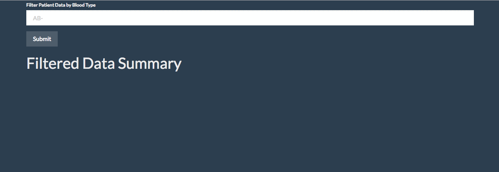

# Filter Blood Types App

## Background

Create a app that filter patient blood types on the data, then return patient stats. 

## Goals

* Use d3 to add an event listener to the form button that does the following:

  * Selects the value of the input element.

  * Uses the form input to filter the data by bloodType.

* Use the [math.js](http://mathjs.org/docs/reference/functions/mean.html) library to calculate the mean, median, mode, variance, and standard deviation for the age field in the filtered data.

* Populate the unordered list `ul` with `li` elements for each summary statistic.

* Use `filter()` to filter the data by bloodType.

* Use `map()` to create an array of age values from the filtered data.

* Use the math.js library to calculate the summary statistics.
